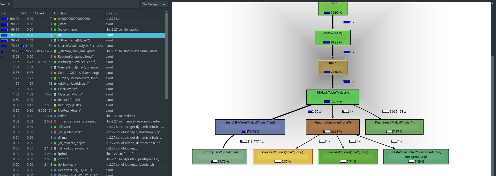
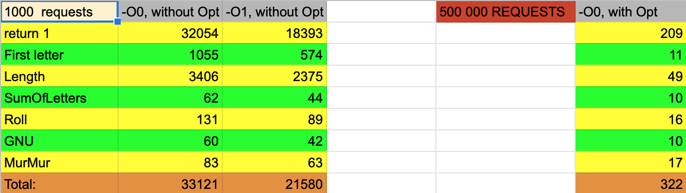
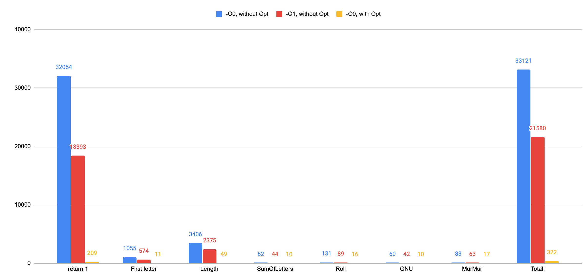

# Description 
This project is a try to make `Hash_Table`, which was created earlier, work faster by rewriting parts of code in ASM.
# Analyze 
After analyzing the code, i have found a weakness: according to callgrind the most slow function is the proccess of searching elemenent in Hash-Table.

Because it is one of the most important functions of project, i have decided to write ASM function, which should work faster, than same on C. 
So this is code of what we had initially:
``` C
bool SearchByValue(MyList *List, char *Value, int Size)
{
        for (int NumOfList = 0; NumOfList <= Size; NumOfList++){
         if (List->Element[NumOfList].data == nullptr)
             continue;

         if (strcmp(List->Element[NumOfList].data, Value) == 0){
             return true;
         }
        }
return false;
}
```
Using http://godbolt.org we have code generated by gcc without any default optimization (-O0)
``` asm
_Z13SearchByValueP6MyListPci:
        push    rbp
        mov     rbp, rsp
        sub     rsp, 48
        mov     QWORD PTR [rbp-24], rdi
        mov     QWORD PTR [rbp-32], rsi
        mov     DWORD PTR [rbp-36], edx
        mov     DWORD PTR [rbp-4], 0
.L6:
        mov     eax, DWORD PTR [rbp-4]
        cmp     eax, DWORD PTR [rbp-36]
        jg      .L2
        mov     rax, QWORD PTR [rbp-24]
        mov     rax, QWORD PTR [rax]
        mov     edx, DWORD PTR [rbp-4]
        movsx   rdx, edx
        sal     rdx, 4
        add     rax, rdx
        mov     rax, QWORD PTR [rax]
        test    rax, rax
        je      .L7
        mov     rax, QWORD PTR [rbp-24]
        mov     rax, QWORD PTR [rax]
        mov     edx, DWORD PTR [rbp-4]
        movsx   rdx, edx
        sal     rdx, 4
        add     rax, rdx
        mov     rax, QWORD PTR [rax]
        mov     rdx, QWORD PTR [rbp-32]
        mov     rsi, rdx
        mov     rdi, rax
        call    strcmp
        test    eax, eax
        jne     .L4
        mov     eax, 1
        jmp     .L5
.L7:
        nop
.L4:
        add     DWORD PTR [rbp-4], 1
        jmp     .L6
.L2:
        mov     eax, 0
.L5:
        leave
        ret
```
Not so fast, isn`t it? A lot of memory calls, some strange staff. 
# Result 
After some time of analyzing, speed measurements of commands and other staff, i have rewrited it
``` asm
global SearchByValue
extern strcmp

section .text

SearchByValue:
       push r15
       push rbx
       mov  QWORD r15, [rdi]
       xor     ebx, ebx
      .Inside:
             cmp     rbx, rdx
             ja     .Not_Found
             mov     rdi, QWORD  [r15]
             test    rdi, rdi
             je      .InsideNext
             call    strcmp
             test    eax, eax
             je      .Found

      .InsideNext:
             inc     rbx
             add     r15, 16
             jmp .Inside
  .Not_Found:
         xor     rax, rax
.EXX:
         pop rbx
         pop r15
         ret
         
.Found:
       mov     rax, 1
       pop rbx
       pop r15
       ret
```
But what about speed? 


**Pretty interesting, yeah? Because my optimized version of Search was so fast, i could not measure time with 1000 requests, so i increased the amount of requests to 500 000! And here you can take a look on the results!**
